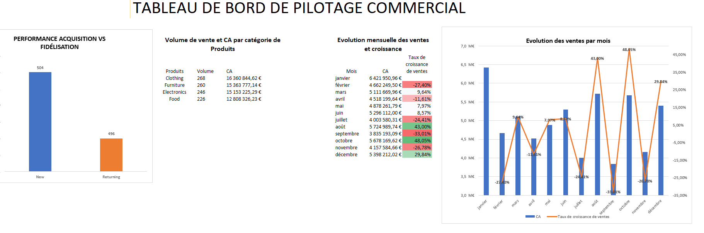

# 📊 Analyse des ventes – Projet Business Analyst (Excel)

## 🏢 Contexte

Ce projet vise à analyser les données de vente d'une entreprise de distribution afin d'identifier les tendances, d'évaluer les performances commerciales et de formuler des recommandations concrètes.

L'intérêt de ce projet réside dans le traitement de données brutes réalistes permettant d'identifier des anomalies majeures et de formuler des recommandations stratégiques concrètes pour le pilotage d'une activité.

NB: Le jeu de données utilisé est **issu de la plateforme Kaggle**. Il s'agit d'un dataset open-source simulant l'historique des ventes d'une entreprise commerciale. 

---

## 🎯 Objectif du Projet
L'objectif est de structurer, nettoyer et analyser ces données de ventes afin de dresser un diagnostic précis de la performance commerciale et financière de l'entreprise, en se concentrant sur 4 axes : la rentabilité, la saisonnalité, la géographie et l'efficacité des équipes.

L'analyse a été réalisée à l'aide d'Excel et comprenait le nettoyage des données, la création d'indicateurs clés de performance (KPI), l'analyse exploratoire et la conception d'un tableau de bord.

---

## 🛠️ Outils utilisés
- Microsoft Excel
- Pivot Tables
- Excel Charts
- Business KPI Analysis

---

## 🧹 Data Cleaning
- Suppression des doublons
- Traitement des valeurs manquantes
- Correction des formats (dates, nombres)
- Vérification de la cohérence des données (ID produit, catégories, vendeurs)
- Renommage des colonnes pour plus de clarté

---

  ## 🔧 Transformation des données
  
Afin d’améliorer la qualité de l’analyse, plusieurs transformations ont été effectuées :

- Création d’une variable “mois” à partir des dates pour l’analyse temporelle
- Création de champs calculés pour faciliter les analyses KPI
- Traitement des incohérences de données sur les ventes
- Création d’un montant théorique pour garantir la cohérence des analyses

----

## 📊 KPI analysés

- Chiffre d’affaires total
- Coût des marchandises vendues (COGS)
- Marge brute
- Taux de marge
- Nombre de ventes
- Panier moyen
- Évolution des ventes dans le temps
- Top produits et catégories

----

## 💡 Analyses & Insights Business

- **Crise de rentabilité structurelle :** Le Chiffre d'Affaires globalisé ne couvre pas le coût total des marchandises vendues. L'entreprise génère une marge brute globale négative.
- **Instabilité de l'activité mensuelle :** Certains produits ont un fort volume de ventes mais une faible rentabilité
- Les performances de ventes varient fortement selon les périodes(ex: creux de -33% en septembre suivi d'un rebond de +48% en octobre)
-  **Sous-performance sectorielle :** La zone géographique *South* affiche un retard de près de 1.5 M€ sur la moyenne des autres régions, ce qui en fait la priorité stratégique n°1 pour le développement commercial.
- **Optimisation des talents :** 45% du chiffre d'affaires repose sur deux commerciaux (David & Eve). 
- **Fidélisation saine :** Un ratio d'achat d'a peu près 50/50 entre les nouveaux clients et les clients réguliers.

---

## 🎯 Recommandations Stratégiques (Les actions à mener)

- **Refonte immédiate de la politique de prix (Pricing) :** Les prix de vente actuels sont trop bas par rapport aux coûts d'achat. Il est impératif d'augmenter les tarifs ou de fixer des prix planchers stricts.L'attractivité auprès des clients (50/50 acquisition/fidélisation) montre que la demande existe et qu'elle peut supporter une réévaluation des prix.
- **📉 Renégociation ou changement de fournisseurs (COGS) :** Le coût des marchandises étant supérieur au CA, un audit des coûts d'approvisionnement est requis. Il faut renégocier les contrats fournisseurs sur les volumes ou diversifier le sourcing pour réduire drastiquement le coût unitaire des produits.
- **Lissage de la saisonnalité :** Mettre en place des campagnes de stimulation commerciale et des promotions ciblées dès la mi-août pour anticiper et atténuer le creux historique constaté en septembre.
- **Audit et redynamisation de la zone South :** Mener une analyse locale sur la région South (étude de la concurrence, adéquation de l'offre ou sous-effectif) et y réallouer temporairement une partie du budget marketing pour combler l'écart de 1,5 M€ avec les autres zones.
- **Partage des meilleures pratiques (Mentoring) :** Organiser des ateliers de partage de compétences où David et Eve documentent leurs techniques de vente afin d'accompagner Charlie et Bob dans l'amélioration de leurs performances.
- **Capitalisation sur la fidélisation :** Introduire un programme de parrainage ou des offres exclusives pour les 496 clients "Returning" afin d'augmenter leur panier moyen, l'acquisition de nouveaux clients étant déjà sur une excellente lancée.

---
## 📈 Dashboard

